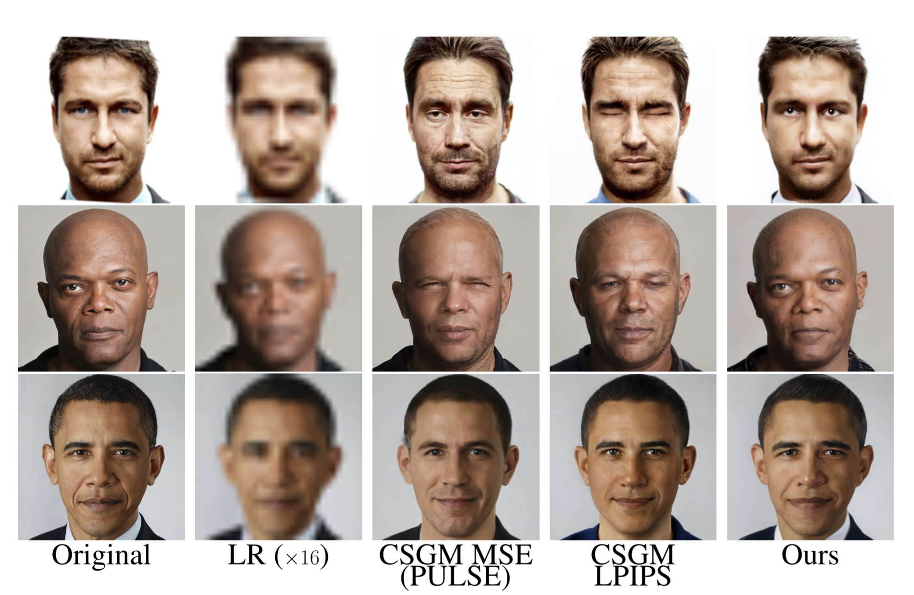
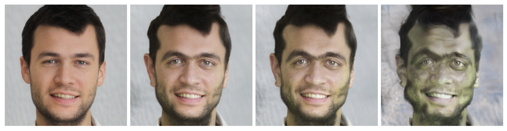

# Official Implementation: Intermediate Layer Optimization for Inverse Problems using Deep Generative Models
 

This repository hosts the official PyTorch implementation of the paper: "Intermediate Layer Optimization for Inverse Problems using Deep Generative Models".
Paper: https://arxiv.org/abs/2102.07364
Authored by: Giannis Daras, Joseph Dean (equal contribution), Ajil Jalal, Alexandros G. Dimakis
Colab demo: 

[](https://rb.gy/tj1ypl)

## Abstract
> We propose Intermediate Layer Optimization (ILO), a novel optimization algorithm for solving inverse problems with deep generative models. Instead of optimizing only over the initial latent code, we progressively change the input layer obtaining successively more expressive generators. To explore the higher dimensional spaces, our method searches for latent codes that lie within a small l1 ball around the manifold induced by the previous layer. Our theoretical analysis shows that by keeping the radius of the ball relatively small, we can improve the established error bound for compressed sensing with deep generative models. We empirically show that our approach outperforms state-of-the-art methods introduced in StyleGAN2 and PULSE for a wide range of inverse problems including inpainting, denoising, super-resolution and compressed sensing.

## Results

### Inpainting


### Super-resolution


### Denoising


### Morphing using a robust classifier



##  Installation
First install the python dependencies by running `pip install -r requirements.txt`.

Next, download dependency files:

`gdown --id 1c1qtz3MVTAvJpYvsMIR5MoSvdiwN2DGb` (shape predictor)

`gdown --id 1JCBiKY_yUixTa6F1eflABL88T4cii2GR` (stylegan pre-trained checkpoint)

If you don't have gdown installed, run: `pip install gdown` first.


## Examples

### Image Preprocessing
Our `prepare_image.py` script offers some basic image preprocessing utilities.
A basic config for the script is given in `configs/preprocess.yaml`.
To change the image preprocessing task or to stack various preprocessing operations together, you need to adjust the arguments of the script.
You can do that by either adjusting the file directly or by passing the corresponding CLI arguments as shown in the following examples.

#### Interactive masking
You can use this tool to create (interactively) masks to your images.

Example command:

`python prepare_image.py preprocessing=\[interactive_mask\] input_files=\[files/original/turing.png,files/original/mona_lisa.png\]`

#### Hard coded mask
You can hard code the location of the mask.

Example command:

`python prepare_image.py preprocessing=\[mask\] input_files=\[files/original/mona_lisa.png\] bounding_box.horizontal=\[100,1000\] bounding_box.vertical=\[100,1000\]`

#### Random mask
Do random inpainting.

Example command:

`python prepare_image.py preprocessing=\[remove_pixels\] input_files=\[files/original/mona_lisa.png\] observed_percentage=\[10,20,30\] per_input=3`


#### Automatically align images

Example command:

`python prepare_image.py preprocessing=\[align\] input_files=\[files/original/mona_lisa.png\]`

#### Chain operations

Example command:

`python prepare_image.py preprocessing=\[interactive_mask,remove_pixels\] input_files=\[files/original/mona_lisa.png\]`

### Solving inverse problems
The script `main.py` can be used to do inpainting, super-resolution, denoising, out-of-distribution generation, etc.
The script in default mode is configured by the file `configs/config.yaml`.

A config file should have the following form:
```
# configures the working direction of hydra.
# If using relative paths, the working directory should be the root folder of ILO.
hydra:
  run:
    dir: '.'

# only StyleGAN is supported for now.
model_type: 'stylegan'

stylegan:
  seed: 42
  device: cuda

  # The pre-trained StyleGAN checkpoint
  ckpt: stylegan2-ffhq-config-f.pt

  ## weights of different losses
  geocross: 0.01
  mse: [1.0, 1.0, 1.0, 1.0, 1.0, 1.0, 1.0, 1.0]
  pe: [1.0, 1.0, 1.0, 1.0, 1.0, 1.0, 1.0, 1.0]
  dead_zone_linear: [1.0, 1.0, 1.0, 1.0]
  # tolerance of dead zone linear function
  dead_zone_linear_alpha: 0.1
  # Additional loss term to a reference image. \
  # Leave it to 0, unless you know what you are doing.
  reference_loss: 0.0

  # hack for making lpips work
  lpips_method: 'fill'
  # classifier used in LPIPS loss
  cls_name: vgg16


  ## Task specific

  # circulant matrices
  fast_compress: false
  observed_percentage: 80

  # can be decreased for super-resolution
  image_size:
    - 1024
    - 1024

  # controls whether we want to match black pixels. Leave to true for inpainting.
  mask_black_pixels: true

  ## Optimization

  # how many steps to run per layer
  steps: '1000, 1000, 1000, 1000, 1000, 1000'
  # whether to project latents to unit ball
  project: true
  # learning rate per layer
  lr: [0.1, 0.1, 0.1, 0.1, 0.1, 0.1, 0.1, 0.1, 0.1]
  # whether to schedule per layer or in total
  lr_same_pace: false
  # Which layer to start optimizing from. Use 0, unless there are saved noises.
  # If you want to skip optimization in some layers, just use 0 to the corresponding indices of steps.
  start_layer: 0
  end_layer: 8
  # Whether to restore opt. variables from previous run.
  restore: false
  # paths to previous opt. variables
  saved_noises:
    - files/noises.pt
    - files/latent.pt
    - files/gen_outs.pt
  # projections
  do_project_gen_out: false
  do_project_noises: false
  do_project_latent: false
  max_radius_gen_out: [1000, 1000, 6000]
  max_radius_noises: [1000, 1000, 6000]
  max_radius_latent: [100, 1000, 6000]

  # specific to video. Leave it as is, unless you know what you are doing.
  is_video: false
  max_frame_radius_gen_out: [200]
  max_frame_radius_noises: [5]
  max_frame_radius_latent: [200]
  video_freq: 30
  per_frame_steps: '100'

  ## files
  # If is_sequence=True, then the input_files and the output_files should be directories.
  is_sequence: false
  input_files:
    - files/original/turing.png
  output_files:
    - files/inpainting/turing.png

  ## specific to datasets
  dataset_type: CelebaHQ
  # if is_dataset=true, then we are sampling from a dataset instead of having fixed files.
  is_dataset: false
  # how many samples to get from dataset. Is activated only when is_dataset=true
  num_dataset: 1
  # extension of dataset files (for glob)
  files_ext: '.png'

  # logging
  # if save_latent=True, then the optimization variables will be saved and can be used in later run.
  save_latent: false
  # if true, intermediate frames from optimization are saved.
  save_gif: false
  # determines how often we save intermediate frames. Activated only if save_gif=True.
  save_every: 50
  # determined whether we our final generated image is the one with the lowest MSE to a reference image.
  save_on_ref: false
```


The role of each parameter is explained in the comments.
Below, we give some example commands for different inverse problems.
For all the examples we are using the default value for `input_files`, but feel free to change it by passing the appropriate CLI argument (or by changing the config file) to run it with your own images.


For any of these tasks, you can either enable l1 projections or no.
Enabling l1 projections helps controlling how close the generated images are to the range of StyleGAN.
The caveat is that tuning the radii of these projections can be particularly toilsome.
For most settings, you will be able to get particularly good results with disabled projections.
Projections are particularly useful when considering out-of-distribution generation.
See there for an example on how to use them.

#### Inpainting
For inpainting, we want to disable perceptual loss and use only MSE loss.
If we have enough measurements, we enable LPIPS loss as well.

Example command:

`python main.py stylegan.mse=\[1.0,1.0,1.0,1.0\] stylegan.pe=\[0.0,0.0,0.0,0.0\] stylegan.steps=\[25,25,25,25\]`


#### Super-resolution
For super-resolution, you only need to specify image-size.
If the original image is higher res, BicubicDownSample will be used for
downscaling prior to inversion.

Example command:

`python main.py stylegan.image_size=\[256,256\] stylegan.mse=\[1.0,1.0,1.0,1.0\] stylegan.pe=\[1.0,1.0,1.0,1.0\] stylegan.steps=\[25,25,25,25\]`

If using LPIPS, make use that your image is at least 256x256.

#### Compressed sensing with circulant matrices
For compressed sensing with partial circulant matrices, we need to enable the `--fast-compress` argument and specify
the `--observed percentage`.


Example command:
`python main.py stylegan.mse=\[1.0,1.0,1.0,1.0\] stylegan.pe=\[0.0,0.0,0.0,0.0\] stylegan.steps=\[300,200,100\] stylegan.fast_compress=1 stylegan.observed_percentage=50`


## Acknowledgments and License

We use the StyleGAN-2 PyTorch implementation of the following repository: https://github.com/rosinality/stylegan2-pytorch.
We wholeheartedly thank the author for open-sourcing this implementation.

The PyTorch implementation is based on the official Tensorflow implementation: https://github.com/NVlabs/stylegan2.
We are grateful to the authors of StyleGAN-2 for their work and their open-sourced code and models.

Please refer to the license files listed in the repositories [1](https://github.com/rosinality/stylegan2-pytorch), [2](https://github.com/NVlabs/stylegan2).
